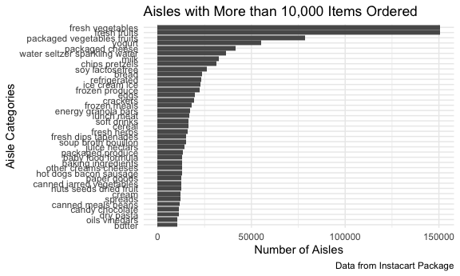

Homework 3 - P8105
================
Sergio Ozoria Ramírez (smo2147)
2025-10-02

# Setup & Loading Instacart Dataset

``` r
library(tidyverse)
library(patchwork)
library(p8105.datasets)
data("instacart")

knitr::opts_chunk$set(
  fig.width = 6,
  fig.asp = .6,
  out.width = "90%"
)

theme_set(theme_minimal() + theme(legend.position = "bottom"))

options(
  ggplot2.continuous.colour = "viridis",
  ggplot2.continuous.fill = "viridis"
)

scale_colour_discrete = scale_colour_viridis_d
scale_fill_discrete = scale_fill_viridis_d
```

# Description of Instacart Dataset

The instacart dataset describes online grocery shopping behaviors from
local stores across New York City from 2017. The dataset contains
**1384617** observations and **15** variables in total, including the
name of the product (i.e., `product name`), the aisle (i.e., `aisle`),
and the department (i.e., `department`). The dataset also includes a mix
of numeric and categorical variables. The average order hour of the day
among shopping users is approximately **14**, whereas the average number
of days since last order is **17**. Altogether, this means users mostly
grocery shop early afternoon with users typically reordering every 17
days.

There are 134 unique aisles in this dataset, with **fresh vegetables,
fresh fruits, packaged vegetables fruits, yogurt, packaged cheese, water
seltzer sparkling water, milk, chips pretzels, soy lactosefree, bread**
being the top 10 aisles where items are mostly ordered from.

``` r
instacart |> 
  count(aisle, sort = TRUE) |> 
  filter(n > 10000) |> 
  ggplot(aes(x = reorder(aisle, n), y = n)) +
  labs(
    title = "Aisles with More than 10,000 Items Ordered",
    x = "Aisle Categories",
    y = "Number of Aisles Ordered",
    caption = "Data: Instacart Online Grocery Shopping (2017)" 
  ) +
  geom_col() +
  coord_flip() +
  scale_y_continuous(
    breaks = c(0, 25000, 50000, 75000, 
               100000, 125000, 150000)
  )
```


