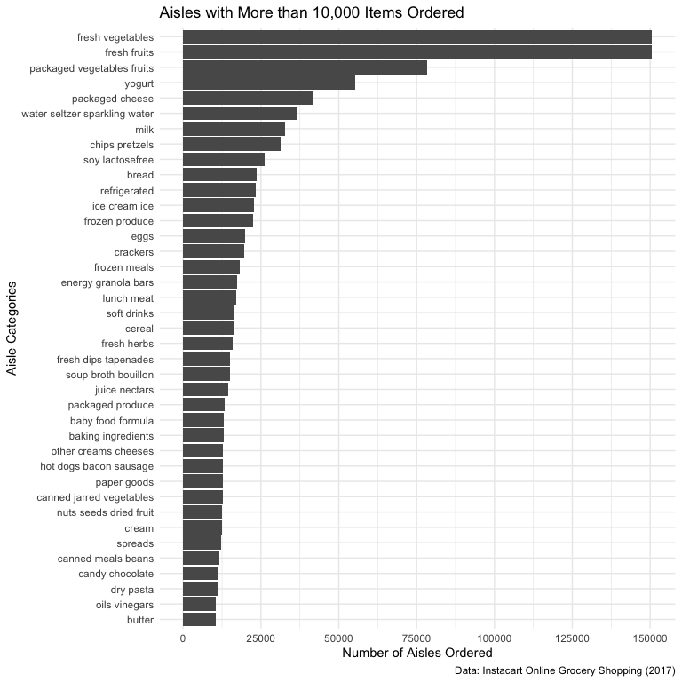

Homework 3 - P8105
================
Sergio Ozoria Ramírez (smo2147)
2025-10-13

# Problem 1

#### Setup & Loading Instacart Dataset

``` r
library(tidyverse)
library(patchwork)
library(p8105.datasets)
data("instacart")

knitr::opts_chunk$set(
  fig.width = 8,
  fig.asp = 1,
  out.width = "100%"
)

theme_set(theme_minimal() + theme(legend.position = "bottom"))

options(
  ggplot2.continuous.colour = "viridis",
  ggplot2.continuous.fill = "viridis"
)

scale_colour_discrete = scale_colour_viridis_d
scale_fill_discrete = scale_fill_viridis_d
```

#### Description of Instacart Dataset

The instacart dataset describes online grocery shopping behaviors from
local stores across New York City from 2017. The dataset contains
**1384617** observations and **15** variables in total, including the
name of the product (i.e., `product name`), the aisle (i.e., `aisle`),
and the department (i.e., `department`). The dataset also includes a mix
of numeric and categorical variables. The average order hour of the day
among shopping users is approximately **14**, whereas the average number
of days since last order is **17**. Altogether, this means users mostly
grocery shop early afternoon with users typically reordering every 17
days.

There are 134 unique aisles in this dataset, with **fresh vegetables,
fresh fruits, packaged vegetables fruits, yogurt, packaged cheese, water
seltzer sparkling water, milk, chips pretzels, soy lactosefree, bread**
being the top 10 aisles where items are mostly ordered from.

#### Figure.1. Bar Chart of Number of Items Ordered by Aisle

``` r
instacart |> 
  count(aisle, sort = TRUE) |> 
  filter(n > 10000) |> 
  ggplot(aes(x = reorder(aisle, n), y = n)) +
  labs(
    title = "Aisles with More than 10,000 Items Ordered",
    x = "Aisle Categories",
    y = "Number of Aisles Ordered",
    caption = "Data: Instacart Online Grocery Shopping (2017)" 
  ) +
  geom_col() +
  coord_flip() +
  scale_y_continuous(
    breaks = c(0, 25000, 50000, 75000, 
               100000, 125000, 150000))
```



#### Table.1. Most Popular Items in Aisles `Baking Ingredients`, `Dog Food Care`, and `Packaged Vegetables Fruits`

``` r
instacart |> 
  filter(aisle %in% c(
    "packaged vegetables fruits",
    "baking ingredients", 
    "dog food care")) |>
  count(aisle, product_name, name = "total_ordered", sort = TRUE) |> 
  group_by(aisle) |> 
  slice_max(total_ordered, n = 3) |> 
   rename(
    Aisle = aisle,
    Product = product_name,
    `# of Items Ordered` = total_ordered
  ) |> 
  knitr::kable()
```

| Aisle | Product | \# of Items Ordered |
|:---|:---|---:|
| baking ingredients | Light Brown Sugar | 499 |
| baking ingredients | Pure Baking Soda | 387 |
| baking ingredients | Cane Sugar | 336 |
| dog food care | Snack Sticks Chicken & Rice Recipe Dog Treats | 30 |
| dog food care | Organix Chicken & Brown Rice Recipe | 28 |
| dog food care | Small Dog Biscuits | 26 |
| packaged vegetables fruits | Organic Baby Spinach | 9784 |
| packaged vegetables fruits | Organic Raspberries | 5546 |
| packaged vegetables fruits | Organic Blueberries | 4966 |

#### Table.2. Mean Order Hour by Day of the Week for `Coffee Ice Cream` and `Pink Lady Apples`

``` r
instacart |> 
  filter(product_name %in% c(
    "Pink Lady Apples",
    "Coffee Ice Cream")) |> 
  group_by(product_name, order_dow) |> 
  summarize(mean_hour = mean(order_hour_of_day, na.rm = TRUE)) |> 
  mutate(order_dow = recode(order_dow,
   `0` = "Sunday",
   `1` = "Monday",
   `2` = "Tuesday",
   `3` = "Wednesday",
   `4` = "Thursday",
   `5` = "Friday",
   `6` = "Saturday",
  )) |> 
  pivot_wider(
    names_from = order_dow,
    values_from = mean_hour) |> 
  rename(Product = product_name) |> 
  knitr::kable(
    digits = 0,
   caption = "Mean order hour by weekday for Coffee Ice Cream and Pink Lady Apples"
  )
```

    ## `summarise()` has grouped output by 'product_name'. You can override using the
    ## `.groups` argument.

| Product          | Sunday | Monday | Tuesday | Wednesday | Thursday | Friday | Saturday |
|:-----------------|-------:|-------:|--------:|----------:|---------:|-------:|---------:|
| Coffee Ice Cream |     14 |     14 |      15 |        15 |       15 |     12 |       14 |
| Pink Lady Apples |     13 |     11 |      12 |        14 |       12 |     13 |       12 |

Mean order hour by weekday for Coffee Ice Cream and Pink Lady Apples

# Problem 2
